<div align="center">


</div>

<div align="center">

[](https://linkedin.com/in/saiverma)
[](mailto:vectorvarma0303@gmail.com)
[](https://github.com/varmaexe)


</div>


<br/>



<br/>

## `◈ // about.go`

```go
package main

import "fmt"

type Hunter struct {
	Name        string
	Rank        string
	Location    string
	Weapons     []string   // primary stack
	Training    []string   // currently mastering
	Guild       string
	ShadowArmy  string     // side project
	Mantra      string
}

func main() {
	hunter := Hunter{
		Name:       "Sai",
		Rank:       "S-Class · Go Backend Developer",
		Location:   "Hyderabad, India 🇮🇳",
		Weapons:    []string{"Go", "Gin", "GORM", "SQL Server", "Microservices"},
		Training:   []string{"Kubernetes", "Docker", "Next.js", "React"},
		Guild:      "Indiana University · IN-POLIS",
		ShadowArmy: "AI-powered fitness coaching CLI (Go + Claude Code)",
		Mantra:     "Reduce 100 DB queries to 1. Always.",
	}
	fmt.Printf("[ ARISE ] %+v\n", hunter)
}
```


## `◈ // skills.mastered`

<div align="center">

-4c1d95?style=flat-square&labelColor=0d0020&color=4c1d95)


<br/>

-4c1d95?style=flat-square&labelColor=0d0020&color=4c1d95)


<br/>

-4c1d95?style=flat-square&labelColor=0d0020&color=4c1d95)


<br/>

-4c1d95?style=flat-square&labelColor=0d0020&color=4c1d95)


</div>


## `◈ // active_quests`

<div align="center">

| ◈ | Quest | Stack | Status |
|---|-------|-------|--------|
| 🏋️ | **fitness-coach** — AI CLI coach via `cat log.txt \| claude` | `Go` `Claude Code` `CLI` |  |
| ☸️ | **K8s Dungeon** — CKA curriculum, core objects to security | `Kubernetes` `Docker` `YAML` |  |
| ⚛️ | **Next.js Gate** — Full stack app, RedWood Trust raid prep | `Next.js` `React` `TypeScript` |  |

</div>


## `◈ // raid_history`

<details>
<summary><b>◈ &nbsp;SAVI Platform — Indiana University &nbsp;·&nbsp; <i>S-Rank Gate · click to enter</i></b></summary>
<br>

> ```
> ◈ GATE CLEARED
> ══════════════════════════════════════════════════
>   TB-scale public health analytics · IN-POLIS
>   Indiana University statewide initiative
> ══════════════════════════════════════════════════
> ```

<div align="center">

| `18+` | `~240ms` | `100 → 1` | `TB` |
|-------|----------|-----------|------|
| Go Microservices | CTE Response Time | DB Query Reduction | Data Scale |

</div>

- ◈ Designed 3-layer architecture (Experience → Process → System) across 18+ services
- ◈ Built custom service mesh for inter-service comms and dependency injection
- ◈ Reduced 100+ sequential DB queries down to a single optimized CTE
- ◈ Led unit test coverage across all 18 repos — handlers, services, middleware, mesh
- ◈ Automated bulk changes across all microservice repos with Python scripting
- ◈ Delivered CSV download, chart data, flat table, and dashboard APIs across domains

</details>

<br/>

<details>
<summary><b>◈ &nbsp;fitness-coach CLI — Shadow Army Project &nbsp;·&nbsp; <i>click to enter</i></b></summary>
<br>

> ```
> ◈ SHADOW EXTRACTED
> ══════════════════════════════════════════
>   AI-powered fitness coach · Claude Code
>   ARISE — and track my gains.
> ══════════════════════════════════════════
> ```

```bash
$ cat workout_log.txt | claude --coaching-mode
# [ SHADOW ACTIVATED ] Analyzing PPLA split...
# [ SYSTEM ] Progressive overload detected. Adjust load.
# [ SYSTEM ] Recovery score: 87/100. You may enter the dungeon.
```

- ◈ Pipe-based workflow for real-time coaching insights via Claude Code
- ◈ Tracks PPLA split performance, sleep recovery data, and progressive overload
- ◈ Token-optimized design with session-based context management per split

</details>


## `◈ // shadow_army` *(contributions)*

<div align="center">
  <picture>
    <source media="(prefers-color-scheme: dark)" srcset="https://raw.githubusercontent.com/varmaexe/varmaexe/output/github-contribution-grid-snake-dark.svg"/>
    <source media="(prefers-color-scheme: light)" srcset="https://raw.githubusercontent.com/varmaexe/varmaexe/output/github-contribution-grid-snake.svg"/>
    
  </picture>
</div>


<br/>

<div align="center">


</div>

<br/>


