<div align="center">


</div>

<div align="center">

[](https://linkedin.com/in/saiverma)
[](mailto:vectorvarma0303@gmail.com)
[](https://github.com/varmaexe)


</div>


## `// about.go`

```go
package main

import "fmt"

type Developer struct {
	Name        string
	Role        string
	Location    string
	Stack       []string
	Learning    []string
	SideProject string
	Mantra      string
}

func main() {
	me := Developer{
		Name:        "Sai",
		Role:        "Go Backend Developer",
		Location:    "Hyderabad, India 🇮🇳",
		Stack:       []string{"Go", "Gin", "GORM", "SQL Server", "Microservices"},
		Learning:    []string{"Kubernetes", "Docker", "Next.js", "React"},
		SideProject: "AI-powered fitness coaching CLI (Go + Claude Code)",
		Mantra:      "Reduce 100 DB queries to 1. Always.",
	}
	fmt.Printf("Building things that scale: %+v\n", me)
}
```


## `// stack.icons`

<div align="center">


</div>


## `// currently_building`

<div align="center">

| | Project | Stack | Status |
|--|---------|-------|--------|
| 🏋️ | **fitness-coach** — AI CLI coach via `cat log.txt \| claude` | `Go` `Claude Code` `CLI` | 🟢 `ACTIVE` |
| ☸️ | **K8s Self-Study** — CKA curriculum, core objects to security | `Kubernetes` `Docker` `YAML` | 🟡 `WIP` |
| ⚛️ | **Next.js Ramp-up** — Full stack app, RedWood Trust prep | `Next.js` `React` `TypeScript` | 🟡 `WIP` |

</div>


## `// highlight_work`

<details>
<summary><b>📊 SAVI Platform — Indiana University &nbsp;|&nbsp; <i>click to expand</i></b></summary>
<br>

> TB-scale public health analytics platform powering the IN-POLIS statewide initiative

<div align="center">

| 18+ | ~240ms | 100 → 1 | TB |
|-----|--------|---------|-----|
| Go Microservices | CTE Response Time | DB Query Reduction | Data Scale |

</div>

- 🏗️ Designed 3-layer architecture (Experience → Process → System) across 18+ services
- 🔧 Built custom service mesh for inter-service comms and dependency injection
- ⚡ Reduced 100+ sequential DB queries down to a single optimized CTE
- 🧪 Led unit test coverage across all 18 repos — handlers, services, middleware, mesh
- 🤖 Automated bulk changes across all microservice repos with Python scripting
- 📦 Delivered CSV download, chart data, flat table, and dashboard APIs across domains

</details>

<br/>

<details>
<summary><b>🏋️ fitness-coach CLI — Personal Project &nbsp;|&nbsp; <i>click to expand</i></b></summary>
<br>

> Personal AI fitness coach powered by Claude Code

```bash
$ cat workout_log.txt | claude --coaching-mode
```

- Pipe-based workflow for real-time coaching insights via Claude Code
- Tracks PPLA split performance, sleep recovery data, and progressive overload
- Token-optimized design with session-based context management per split

</details>


## `// contribution_snake`

<div align="center">
  <picture>
    <source media="(prefers-color-scheme: dark)" srcset="https://raw.githubusercontent.com/varmaexe/varmaexe/output/github-contribution-grid-snake-dark.svg"/>
    <source media="(prefers-color-scheme: light)" srcset="https://raw.githubusercontent.com/varmaexe/varmaexe/output/github-contribution-grid-snake.svg"/>
    
  </picture>
</div>


<div align="center">


</div>


